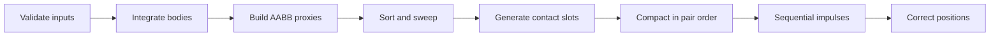
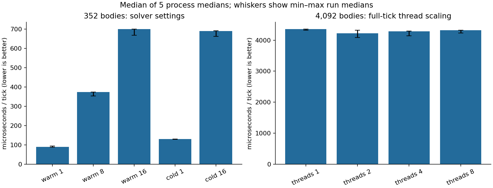
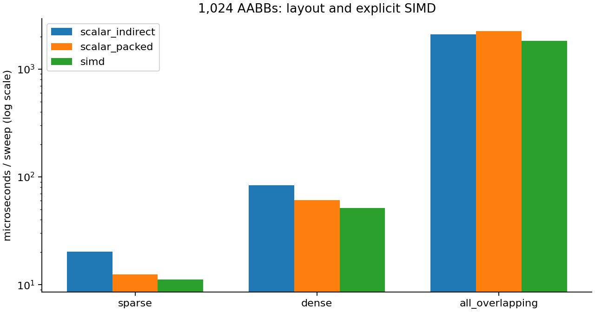

# Physics Engine

A C++20 sphere rigid-body engine exploring **reproducible parallel simulation and CPU
performance**. The physics core is headless; the optional SFML demo visualizes the
same library used by the tests and benchmarks.


## Build and run

Requires **CMake 3.24+** and a **C++20 compiler**. The CI workflow targets Linux and
macOS. The default build needs no graphics dependencies. GoogleTest 1.14.0 is
fetched on the first configure, so building tests requires network access initially.

```sh
cmake -S . -B build -DCMAKE_BUILD_TYPE=Debug -DPHYSICS_WARNINGS_AS_ERRORS=ON
cmake --build build --parallel
ctest --test-dir build --output-on-failure
./build/headless_replay --threads 4 --steps 240
```

Set `-DBUILD_TESTING=OFF` for a dependency-free headless build. The replay executable
compares serial and parallel body-state bit patterns at every tick, exits nonzero
on the first mismatch, and prints a trajectory digest.

The optional demo requires **SFML 2.5+ in the 2.x series**:

```sh
cmake -S . -B build-demo -DCMAKE_BUILD_TYPE=Release -DBUILD_DEMO=ON
cmake --build build-demo --target physics --parallel
./build-demo/physics
```

Left click spawns a sphere; Space pauses; N steps while paused; R resets; T toggles
trails; Up/Down changes playback speed; Escape exits. The demo adds its own arena
boundary behavior; the core collision shapes are spheres.

## Engine design

- Semi-implicit Euler integration, with fixed-timestep accumulation owned by the caller.
- Linear and angular state, quaternions, forces and torques, solid-sphere inertia.
- Sweep-and-prune broadphase with indirect scalar, packed scalar, and explicit NEON/SSE2
  paths. Brute force and a BVH provide reference/experimental alternatives.
- Sequential impulses with restitution, accumulated normal impulses, a Coulomb friction
  disk, warm starting, and bounded per-contact position correction.
- Parallel integration, proxy construction, and narrowphase. Each job writes an indexed
  output slot; serial compaction restores pair order before the serial solver.
- Independent reservations for bodies, candidate pairs, and contacts. Buffers grow when
  needed; capacity exhaustion never silently discards collisions.

`World` owns a `RigidBodySystem`, which owns body storage, collision scratch, solver
state, and an optional thread pool. A tick follows this dependency chain:



The solver stays serial because each constraint reads velocities written by the
previous constraint. Parallelizing that dependency chain would require another design
and another reproducibility argument. [Design and API contracts](docs/DESIGN.md)
describe ownership, numerical assumptions, memory behavior, and failure handling.

## Using the library

```cpp
#include "physics/World.hpp"

World world(Vec3(0.f, -9.8f, 0.f));
world.reserveRigidBodies(2);
world.reserveCollisionCapacity(1, 1); // candidate-pair and contact hints

const auto ground = world.createRigidBody(0.f, 100.f); // zero mass = static
world.rigidBody(ground).position = Vec3(0.f, -100.f, 0.f);
world.rigidBody(ground).material.restitution = 0.2f;

const auto ball = world.createRigidBody(1.f, 0.5f);
world.rigidBody(ball).position = Vec3(0.f, 5.f, 0.f);
world.rigidBody(ball).material.restitution = 0.2f;
world.rigidBody(ball).setMass(2.f); // updates inverse mass and inertia together

for (int tick = 0; tick < 180; ++tick)
  world.step(1.f / 60.f);
```

`setWorkerThreadCount(N)` counts the caller among the N threads; 1 runs inline and
0 selects the reported hardware concurrency. Body IDs are append-only indices.
References returned by `rigidBody(id)` can be invalidated by storage growth, so retain
IDs and reacquire references after creation/reservation. Public state and material may
be edited between ticks; mass, radius, and derived inertia use a protected interface.

## Reproducibility and tests

The supported replay scope is **the same executable, initial state, input sequence,
settings, timestep, and floating-point environment**, with different worker scheduling
or worker counts. Cross-architecture, cross-compiler, and cross-build bitwise replay
are not promised. Unsafe floating-point flags are rejected and FP contraction is
explicitly disabled for GCC/Clang builds.

Tests cover physical response, coincident centers, input and mutation contracts,
broadphase pair equivalence, bit patterns at every tick, first/steady-state allocation
behavior on 1/2/4/8 threads, partial thread creation failure, callback exceptions,
recursive/concurrent submission rejection, and tangent-cache basis changes.

Allocation instrumentation counts ordinary and aligned C++ allocations. It does not
intercept direct `malloc`, measure page faults, or imply a worst-case execution deadline.
The thread pool uses mutexes and condition variables. This is not a hard real-time engine.

The CI workflow runs Debug/Release builds on Linux/macOS, builds the demo and benchmarks,
and runs ThreadSanitizer plus AddressSanitizer/UndefinedBehaviorSanitizer on Linux.
Allocation interception tests are excluded under ASan. Local verification and remaining
hosted publication checks are recorded in [RELEASE_CHECKLIST.md](RELEASE_CHECKLIST.md).

## Performance experiments



The [performance report](docs/performance/README.md) includes raw samples, exact build
and machine information, repeated-process variability, solver quality, stage timings,
and a sampled profile. It also separates data packing from explicit SIMD:



```sh
cmake -S . -B build-release -DCMAKE_BUILD_TYPE=Release -DBUILD_BENCHMARKS=ON
cmake --build build-release --parallel
./build-release/world_step_bench --scene columns --bodies 352 --threads 1 --csv
./build-release/contact_solver_bench --iterations 1 --warm-start 0
./build-release/headless_replay --threads 8
```

| Target | What it measures |
|---|---|
| `world_step_bench` | Dynamic full ticks; raw latency, pair/contact counts, compression |
| `contact_solver_bench` | The same full-tick workload with configurable solver settings |
| `collision_pipeline_bench` | Instrumented dynamic stages, including integration |
| `memory_budget_bench` | Reserved vector storage versus body and collision hints |
| `body_layout_bench` | Verified synthetic AoS/SoA kernels; not an engine speedup prediction |
| `sweep_mode_bench` | Indirect scalar, packed scalar, SIMD; sparse/dense/all-overlapping AABBs |
| `job_system_bench` | Integration/full-tick scaling and synchronized false-sharing experiments |
| `aabb_pair_bench`, `bvh_pair_bench` | Broadphase alternatives and BVH stages |
| `sphere_pair_bench`, `vec3_bench` | Sphere overlap and scalar math kernels |

## Scope and layout

The core supports solid spheres and static bodies. It does not implement general
convex shapes, joints, sleeping, contact islands, continuous collision detection,
rolling resistance, or checkpoint restoration. Fast bodies can tunnel at large
steps; stacked spheres can be unstable; position correction is an approximation.

```text
math/       Vec3, Mat3, Quat
core/       JobSystem
collision/  AABBs, sweep-and-prune, BVH, sphere overlap
physics/    body state, contact solver, World, bitwise snapshots
tests/      GoogleTest suites by subsystem
bench/      headless measurement executables
scripts/    reproducible benchmark report and demo encoding
demo/       serial/parallel replay verifier
main.cpp    optional SFML demo
```

## Developer tools

Formatting is pinned to clang-format 18.1.8. Optional report dependencies are separate
from the C++ build:

```sh
python3 -m venv .cache/tools
.cache/tools/bin/python -m pip install -r requirements-format.txt -r requirements-report.txt
find math physics collision core tests bench demo main.cpp \
  \( -name '*.cpp' -o -name '*.hpp' \) -print0 \
  | xargs -0 .cache/tools/bin/clang-format --dry-run --Werror
.cache/tools/bin/python scripts/benchmark_report.py --build build-release --repeats 5
```

See [CONTRIBUTING.md](CONTRIBUTING.md) for validation commands. Licensed under MIT.
